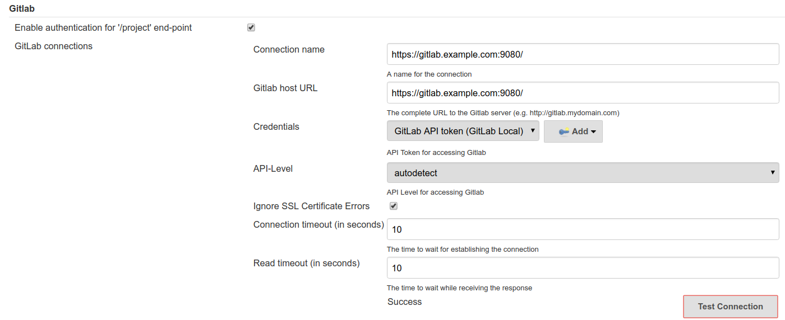

= IMPORTANT

== Prerequisites

Install GitLab runner. To do that visit:

https://docs.gitlab.com/runner/install

== Installation

For all sublessons from this lesson you have to first execute

```bash
pushd 00-tech/src/main/resources/docker
	./start.sh
popd
```

IMPORTANT: REMEMBER TO ENTER THE `127.0.0.1       gitlab.example.com` ENTRY
IN `/etc/hosts`

That way you will have the following infrastructure running

* http://localhost:8081/artifactory[Artifactory]
* https://gitlab.example.com:9080[Gitlab]

== Gitlab

* Log in as `root/rootroot`
* Add your ssh key (top right -> settings -> ssh keys)
* Generate a Token for Jenkins (https://gitlab.example.com:9080/profile/personal_access_tokens)

== Jenkins

We also need a CI tool:

```bash
$ wget http://mirrors.jenkins.io/war-stable/latest/jenkins.war
```

When setting up Jenkins remember to pass the clone URLs like this:

```
ssh://git@gitlab.example.com:9922/01-provider-maven/provider.git
```

* Install plugins
** GitLab merge request
** Jenkins Job DSL
** ansicolor
** Whatever you want
* Set up JDK (e.g. ` ~/.sdkman/candidates/java/current/`)
* Add a GitLab token credential
* Set up GitLab integration



* Configure global security for GitLab - https://github.com/timols/jenkins-gitlab-merge-request-builder-plugin

== The flow

* We will interact with GitLab
* Jenkins will be configured to build a project from GitLab and push to Artifactory
* We will trigger Jenkins jobs manually